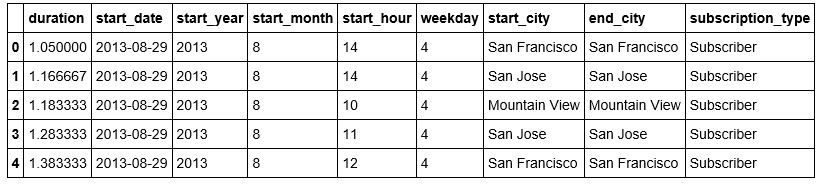
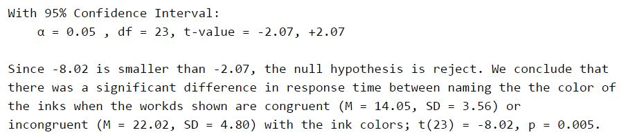
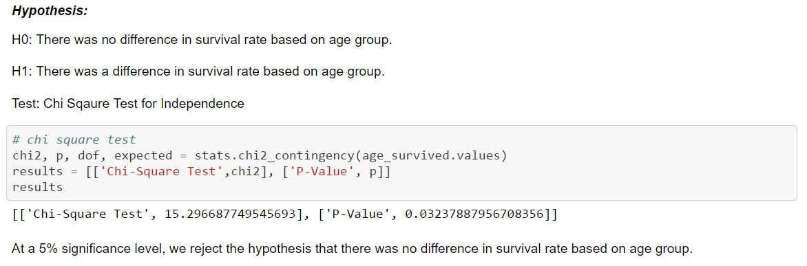
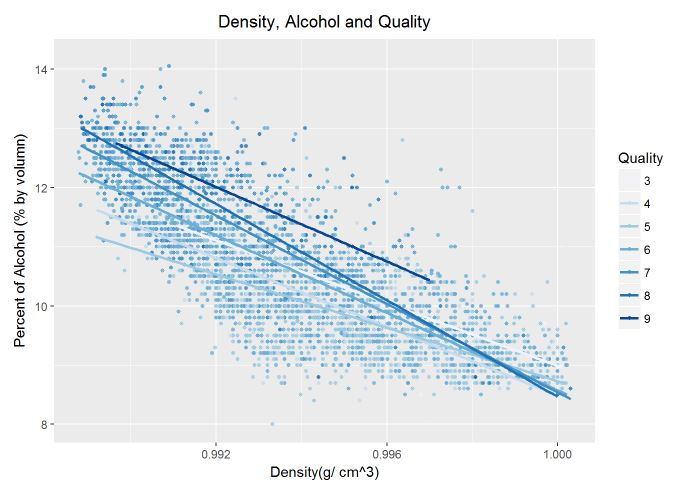
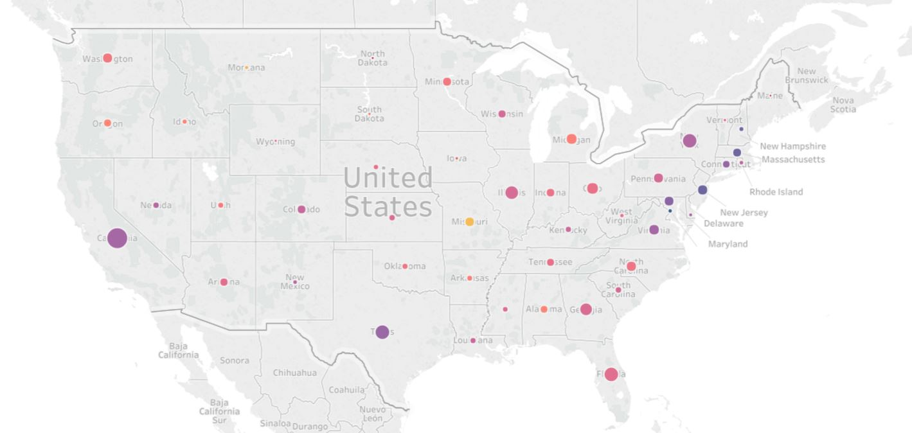

# Udacity- Data Analyst Nanodegree

 <a href="https://www.udacity.com/course/data-analyst-nanodegree--nd002">
The Nanodegree's website</a> 

### This nanodegree covers: 
- Programming languages: Python, R, SQL, HTML, CSS, Javascript
- Python packages/ libraries:  NumPy, pandas, Matplotlib, SciPy, scikit-learn
- Skills: data extraction and wrangling, data visualization, machine learning, statistics, A/B testing 

### Projects
- [x] [Project 0: Bay Area Bike Share Analysis](https://github.com/Sally-Ng/DAND-Bay_Area_Bike_Share_Analysis)
- [x] [Project 1: Test a Perceptual Phenomenon](https://github.com/Sally-Ng/DAND-Test_a_Perceptual_Phenomenon)
- [x] [Project 2: Investigate the Titanic Dataset](https://github.com/Sally-Ng/DAND-Investigate_The_Titanic_Dataset)
- [x] Project 3: Wrangle OpenStreetMap Data
- [x] [Project 4: White Wine Dataset Exploratory Data Analysis](https://github.com/Sally-Ng/DAND-White_Wine_Dataset_Exploratory_Data_Analysis)
- [x] Project 5: Identify Fraud from Enron Email
- [x] Project 6: Exploring the Loan Data from Prosper(https://github.com/Sally-Ng/DANA-Exploring_the_Loan_Data_from_Prosper)

### Courses
- Statistics  
- Intro to Data Analysis  
- Data Wrangling  
- Exploratory Data Analysis  
- Intro to Machine Learning  
- Data Visualization  
 
 

[Project 0: Bay Area Bike Share Analysis](https://github.com/Sally-Ng/DAND-Bay_Area_Bike_Share_Analysis)  
Language: Python (pandas, NumPy, Matplotlib)  
Used tables and histograms to explore and visualize the Bay Area Bike Share data. 
 

  

 

[Project 1: Test a Perceptual Phenomenon](https://github.com/Sally-Ng/DAND-Test_a_Perceptual_Phenomenon)  
Language: Python (pandas, NumPy, Matplotlib, SciPy)  
Analyzed the Stroop effect using descriptive statistics to provide an intuition about the data, 
and a two-tailed dependent sample t-test to draw a conclusion.
 

  

 

[Project 2: Investigate the Titanic Dataset](https://github.com/Sally-Ng/DAND-Investigate_The_Titanic_Dataset)  
Language: Python (pandas, NumPy, Matplotlib, SciPy, PyLab)  
Skills: Hypothesis testing, Data visualization, Data Wranggling  
Used descriptive statistics and Chi Sqaure Test for Independence to investigate factors that made people more likely to survive. 
 

  

 

[Project 4: White Wine Dataset Exploratory Data Analysis](https://github.com/Sally-Ng/DAND-White_Wine_Dataset_Exploratory_Data_Analysis)  
Language: R (ggplot2, dplyr, memisc, GGally, gridExtra)  
Used histograms, boxplots, scatter plots and correlation matrix to explore and visualize the White Wine dataset. 
The relationships between the variables have been investigated by computing Pearson Correlation tests and 
the multiple linear regression.
 

  

[Project 6: Exploring the Loan Data from Prosper](https://github.com/Sally-Ng/DANA-Exploring_the_Loan_Data_from_Prosper)  
Sofeware: Tableau  
Skills: Data visualization, Descriptive Statistics  
v   

  

