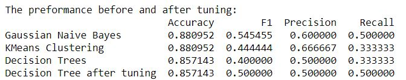

# Udacity- Data Analyst Nanodegree
Completed in July, 2017 

 <a href="https://www.udacity.com/course/data-analyst-nanodegree--nd002">
The Nanodegree's website</a> 

### This nanodegree covers: 
- Programming languages: Python, R, SQL, HTML, CSS, Javascript
- Python packages/ libraries:  NumPy, pandas, Matplotlib, SciPy, scikit-learn
- Skills: Data Extraction and Wrangling, Data Visualization, Machine Learning, Statistics

### Projects
- [x] [Project 0: Bay Area Bike Share Analysis](https://github.com/Sally-Ng/DAND-Bay_Area_Bike_Share_Analysis)
- [x] [Project 1: Test a Perceptual Phenomenon](https://github.com/Sally-Ng/DAND-Test_a_Perceptual_Phenomenon)
- [x] [Project 2: Investigate the Titanic Dataset](https://github.com/Sally-Ng/DAND-Investigate_The_Titanic_Dataset)
- [x] [Project 3: Wrangle OpenStreetMap Data](https://github.com/Sally-Ng/DAND-OpenStreetMap_Data_Exploration)
- [x] [Project 4: White Wine Dataset Exploratory Data Analysis](https://github.com/Sally-Ng/DAND-White_Wine_Dataset_Exploratory_Data_Analysis)
- [x] [Project 5: Identify Fraud from Enron Email](https://github.com/Sally-Ng/DAND-Identify_Fraud_from_Enron_Email)
- [x] [Project 6: Exploring the Loan Data from Prosper](https://github.com/Sally-Ng/DANA-Exploring_the_Loan_Data_from_Prosper)

### Courses
- Statistics  
- Intro to Data Analysis  
- Data Wrangling  
- Exploratory Data Analysis  
- Intro to Machine Learning  
- Data Visualization  
 
 

[Project 0: Bay Area Bike Share Analysis](https://github.com/Sally-Ng/DAND-Bay_Area_Bike_Share_Analysis)  
Language: Python (pandas, NumPy, Matplotlib)  
Skills: Data Exploration, Data Visualization  
Used tables and histograms to explore and visualize the Bay Area Bike Share data. 
 

  

 

[Project 1: Test a Perceptual Phenomenon](https://github.com/Sally-Ng/DAND-Test_a_Perceptual_Phenomenon)  
Language: Python (pandas, NumPy, Matplotlib, SciPy)  
Skills: Hypothesis Testing, Measures of Variability, Data Visualization  
Analyzed the Stroop effect using descriptive statistics to provide an intuition about the data, 
and a two-tailed dependent sample t-test to draw a conclusion.
 

  

 

[Project 2: Investigate the Titanic Dataset](https://github.com/Sally-Ng/DAND-Investigate_The_Titanic_Dataset)  
Language: Python (pandas, NumPy, Matplotlib, SciPy, PyLab)  
Skills: Hypothesis Testing, Data Visualization, Data Wranggling  
Used descriptive statistics and Chi Sqaure Test for Independence to investigate factors that made people more likely to survive. 
 

  

 

[Project 3: Wrangle OpenStreetMap Data](https://github.com/Sally-Ng/DAND-OpenStreetMap_Data_Exploration)  
Language: Python (pandas, re, sqlite3), SQL  
Skills: Data Wranggling, Data Cleaning, SQL(Database Creating and Data Analysis)  
After the data has been audited, standardized, and converted from XML to CSV format, it was used to create a SQL database for data analysis. 

  

 

[Project 4: White Wine Dataset Exploratory Data Analysis](https://github.com/Sally-Ng/DAND-White_Wine_Dataset_Exploratory_Data_Analysis)  
Language: R (ggplot2, dplyr, memisc, GGally, gridExtra)  
Skills: Inferential Statistics, Data Visualization  
Used histograms, boxplots, scatter plots and correlation matrix to explore and visualize the White Wine dataset. 
The relationships between the variables have been investigated by computing Pearson Correlation tests and 
the multiple linear regression.
 

  

 

[Project 5: Identify Fraud from Enron Email](https://github.com/Sally-Ng/DAND-Identify_Fraud_from_Enron_Email)
Language: Python (scikit-learn, pandas, Matplotlib)  
Skills: Machine Learning, Feature Scaling, Feature Selection, Validation  
Built machine learning algorithms to identify Enron Employees who may have committed fraud based on the public Enron financial and email dataset. 

  

 

[Project 6: Exploring the Loan Data from Prosper](https://github.com/Sally-Ng/DANA-Exploring_the_Loan_Data_from_Prosper)  
Sofeware: Tableau  
Skills: Data Visualization, Descriptive Statistics  
Created a data visualization that tells a story and highlights patterns about loan in the loan data set from Prosper using Tableau.  

  

 

  

